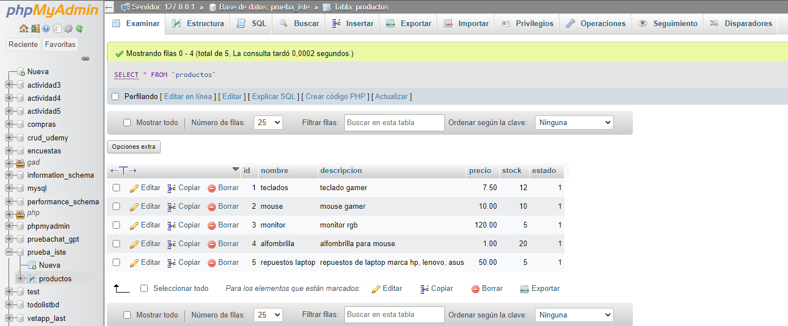
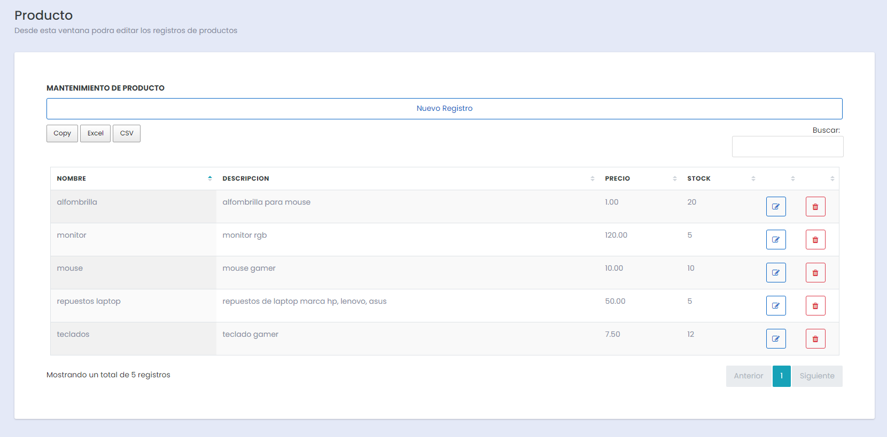
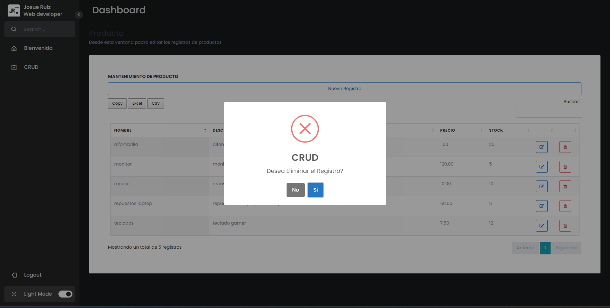
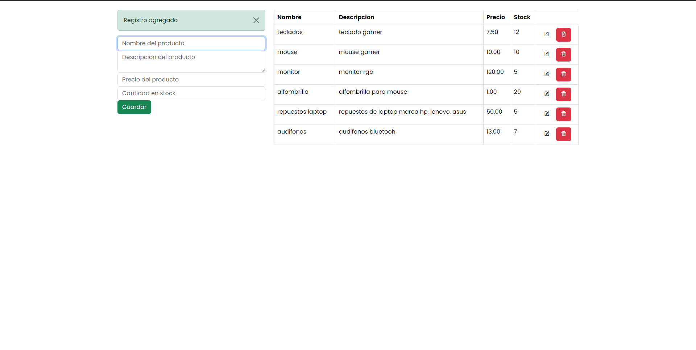
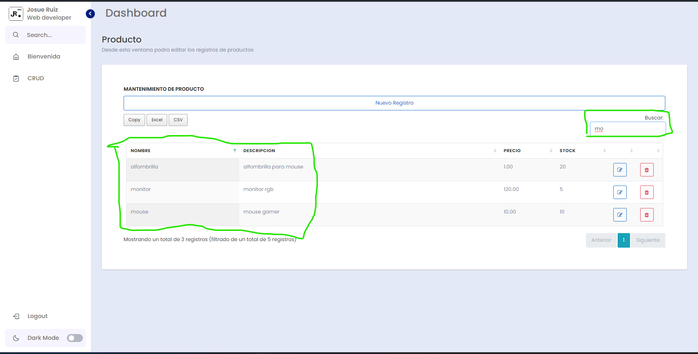
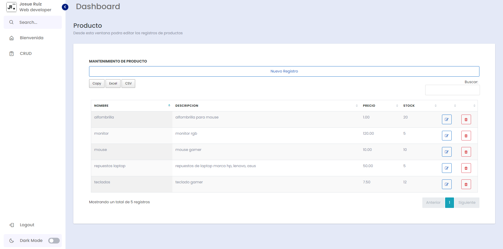
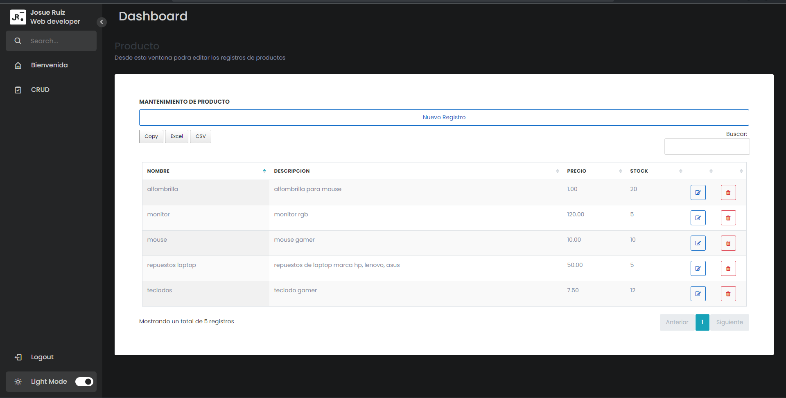

# PRUEBA_ISTE
**Bienvenido a este proyecto**

**Instalación:**
Herramientas que deben estar instaladas y configuradas de antemano:
- Xampp
- Visual studio code

Para poder tener el entorno de desarrollo y pruebas locales con el servidor apache y mysql

El proyecto se debe ejecutar desde la ruta: http://localhost:3000/view/index.php (cambiar el puerto dependiendo de la configuración en su equipo)

# Introducción:
De antemano agradecer a la institución por darme la oportunidad de postular y probarme a mi mismo con retos y oportunidades, siento que pude haber realizado las cosas de mejor manera pero no me detendre aprendiendo y mejorando.

# Ejercicio:
**Creación de CRUD con Búsqueda, Tabla de Datos y Despliegue**

**Instrucciones:** El objetivo de esta prueba es evaluar tu capacidad para implementar un CRUD completo (Crear, Leer, Actualizar, Eliminar) con opción de búsqueda, interactuar con una base de datos y diseñar una interfaz de usuario amigable. Puedes elegir cualquier lenguaje de programación, base de datos y plataforma de despliegue con la que te sientas cómodo. Sin embargo, se otorgarán puntos adicionales si utilizas tecnologías que son especialmente relevantes para nuestra organización, tales como: Python, Javascript, PostgreSQL, AWS (EC2), Next.js, Django, y Flutter.

 

**Tarea 1: Crear una Tabla en la Base de Datos**

Crea una tabla llamada "Productos" con los siguientes campos:

·         ID (clave primaria)

·         Nombre

·         Descripción

·         Precio

·         Cantidad en stock

- *Para esta parte de la actividad lo realice con la ayuda de la herramienta phpmyadmin para crear y probar la base de datos del programa en localhost:*

**Tarea 2: Crear Operaciones CRUD**

Desarrolla tanto la interfaz de usuario como la lógica del servidor (backend) para implementar las siguientes operaciones CRUD para la tabla "Productos":

·         Crear Producto: Añade un nuevo registro de producto en la base de datos.

·         Leer Productos: Muestra todos los productos almacenados en la base de datos.

·         Actualizar Producto: Modifica la información de un producto existente según su ID.

·         Eliminar Producto: Remueve un producto de la base de datos según su ID.

 
- *Para esta tarea utilice el lenguaje de php usando el patron de diseño MVC que llevaba tiempo sin volver a utilizar pero lo vi una buena practica para la creacion de este CRUD, sin embargo funciones como las de Insertar y actualizar tuvieron conflictos que por el tiempo de entregar no se me fue posible solucionar*

- *Sin embargo habia realizado un crud funcional sin mucha experiencia visual enfocado en el funcionamiento el cual se puede acceder desde la carpeta "crud_simple" ejecutando index.php*

**Tarea 3: Agregar Función de Búsqueda**

Incorpora una opción de búsqueda por nombre de producto. Al ingresar un nombre, debe mostrar los productos cuyos nombres coincidan o sean similares al término de búsqueda.

- *Para esta tarea utilice las librerias de Datatables para una mejor gestion de las tablas y registros del CRUD*

 

**Tarea 4: Despliegue en Línea (Puntos Extras)**

Si es posible, despliega el sistema en un entorno en línea, como una plataforma de hosting o servidor en la nube. Proporciona la URL donde el sistema esté operativo para su evaluación. Recuerda no usar credenciales reales ni exponer información sensible en el despliegue.

 

**Tarea 5 (Puntos Extras): Diseño y Usabilidad**

Aunque el enfoque principal es la funcionalidad, la presentación y la usabilidad también son importantes. Considera implementar un diseño amigable y coherente para la interfaz de usuario.

* Para esta tarea utilice conocimientos basicos de CSS y Javascript para colocar el CRUD dentro de un Sidebar de contenidos que podria ser utilizado en un sistema con apartados y botones para modo claro y modo oscuro, ademas de que las librerias Datatables permiten descargar los registros en hojas de formato excel.

 
 

**Instrucciones de Entrega:**

·         Proporciona el código completo mediante un repositorio en GitHub o GitLab.

·         Si realizas el despliegue en línea, facilita la URL y cualquier información necesaria para acceder al sistema.

·         Asegúrate de que tu código incluya validaciones básicas y manejo de errores adecuado.
